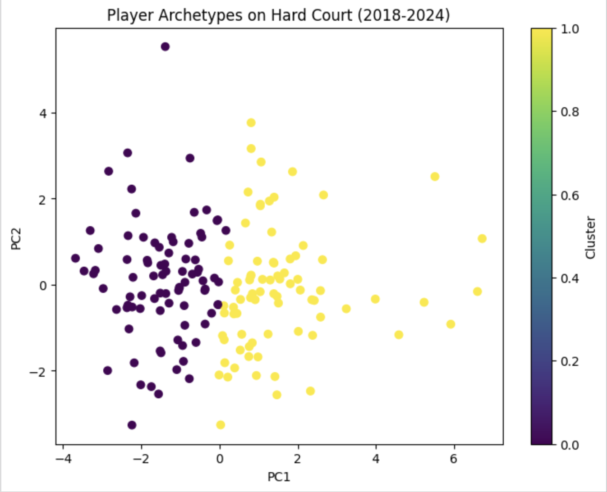

+++
date = '2025-12-15T15:25:27-08:00'
draft = false
title = 'Mapping ATP Hard-Court Archetypes (Phase 1)'
+++

## Motivation
I wanted to see whether the ATP Tour hides recognizable personas once you strip away ranking power. So I grabbed six seasons (2018-2024) of hard-court matches, kept only players with a meaningful sample, and let the numbers sketch the characters.

## Setting the stage
Hard courts only, 2018-2024. Match stats from Jeff Sackmann's [feed](https://github.com/JeffSackmann/tennis_atp), weekly rankings layered in to keep "style" separate from "strength". Each match becomes two perspectives (one per player) so serve and return tendencies stand on their own.

## The signals I watched
- Serve posture: aces per service point (fire) vs. double faults (risk), plus how often first serves land and win.
- Pressure momets: break points faced and saved.
- Return bite: reconstructed from the opponent's serve outcomes and how often break chances turn into breaks.

These are z-scored within ranking bands so a top-10 and a top-200 player can be compared on how they choose to play, not just how performant they are.

## What emerged
- **The flamethrowers**: Jump out with higher ace rates and accept slightly more double faults. First serves do most of the damage; their returns matter less because they're often front-running on serve. This cluster shows noticeably better win rates and average rank-ability *still* leaks in.
- **The neutralizers**: Lower ace counts but stingy with double faults. They make you play, win more on return points, and turn pressure back on opponents through break conversion.

PCA is used prior to clustering for dimensionality sanity (retain ≥80% variance). Serve dominance is the main latent axis: "style" here is tied to "how big is your serve?" That's why ability still shows up in the results - the bigger the game, the more the wins. Phase 2 will work harder to decouple that.

KMeans with a silhouette search over k=2-9 point to 2 stable groups amongst the players, as shown in the group descriptions above.

## Visualization

Purple points (flamethrowers) sit left of center: bigger serves, higher ace/DF risk, and they also post the better win rates/ranks. Yellow points (neutralizers/steady servers) spread to the right: lower-ace, lower-risk serves with more teeth on return.

## See the work
The full pipeline, data notes, and code live in this [Github repository](https://github.com/emmyp/atp_archetypes).
